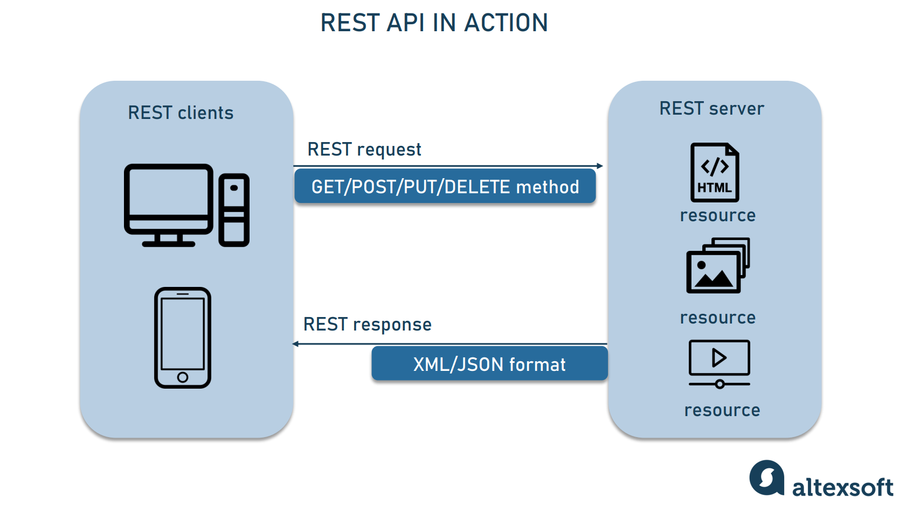

# Темы урока: 
* Понятие самого API
* SWAGGER - как смысл жизни
* Понятие REST
* ASP.NET Core Web API

# Понятие самого API
API (Application Programming Interface) - это набор методов, функций, процедур, классов и т.д., которые предоставляются для использования внешними приложениями.

Моя любимая часть и мой любимый вопрос:

### Что такое интерфейс ?
Способ взаимодействия с чем либо.

Давайте напишем простой API, сперва на C#, потом на Python... 

### SWAGGER 

Это инструмент для простого взаисодействия с API, он показывает какие конуретно 
методы есть в вашей программе. С ним легко работать на этапе разработки,
но на этапе продакшена его лучше убрать. 

#### Плюсы SWAGGER
* Понятный интерфейс
* Можно тестировать API
* Легко отлавливать ошибки
* Можно сгенерировать документацию
* Быстрый доступ к методам

#### Минусы SWAGGER
* Неудобно работать с большим количеством методов
* Неудобно работать с большим количеством параметров


# Понятие REST

REST как и SOLID, всего лишь парадигма, которая помогает нам писать правильный код. 

## Расшифровывается как Representational State Transfer, что в переводе означает «передача состояния представления».

### О чем это говорит ?
О том, что вся информация, которая передается между клиентом и сервером, должна быть представлена в виде ресурсов.

### Что такое ресурс ?
Ресурс — это любая информация, которая может быть представлена в виде текста, набора изображений, видео или любого другого формата.




Пример REST запроса:
```
GET /api/cars/1
```

Пример REST ответа:
```
{
    "id": 1,
    "name": "BMW",
    "model": "X5",
    "price": 1000000
}
```

Пример не REST запроса:
```
GET /api/cars/getCarById?id=1
```


Пример REST запроса с параметрами на C#:
```
[HttpGet]
[Route("api/cars/{id}")]
public IActionResult GetCarById(int id)
{
    var car = _cars.FirstOrDefault(x => x.Id == id);
    if (car == null)
    {
        return NotFound();
    }
    return Ok(car);
}
```


