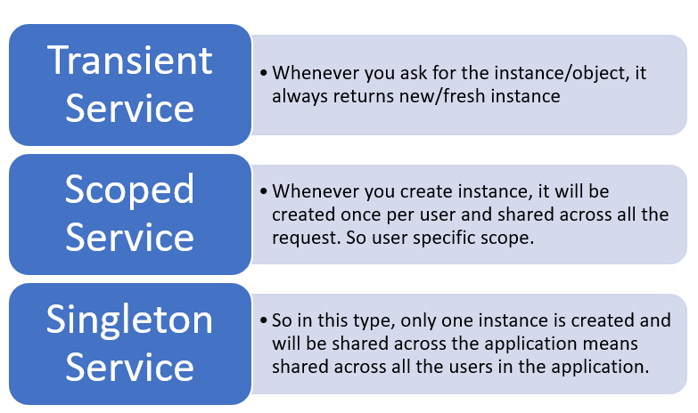

# Dependency Inversion vs Dependency Injection

### На этом уроке я раз и на всегда расскажу вам все что надо об этом знать. 

# Основные моменты по уроку: 
1. Dependency Inversion Principle - это про взаимодействие между слоями приложения, то есть классами.
2. Dependency Injection - это про то как мы передаем зависимости в классы, то есть как объекты создаются и передаются в классы.
3. DI Container - это принцип хранения и создания объектов в приложении.

# Dependency Inversion Principle
Во всех более менее крупных ООП проектах есть зависимости между классами и нужда на будущее масштабирование. ***Классы верхнего уровня не должны зависеть от классов нижнего уровня.*** 

Что такое класс верхнего уровня ? 
Самый высококоуровневый класс в приложении - это `UserController`, который является контроллером веб приложения.
Предположим что у меня есть класс `UserService`, который отвечает за работу с пользователями. В нем есть методы для создания, удаления, обновления и получения пользователей. Это класс верхнего уровня. 

А что такое класс нижнего уровня ?
В нашем случае если, `UserService` отвечает за работу с пользователями, то класс нижнего уровня это класс `User`, 
который и есть наш DTO(Data Transfer Object) или просто модель.

Как сделать так чтобы классы верхнего уровня не зависели от классов нижнего уровня ?

Для этого нужно использовать интерфейсы. 
В нашем примере, так как класс `User` - это DTO, нет смысла создавать для него интерфейс, так как он не будет меняться. Он либо будетб либо нет, а при изменении повлияет только на БД.

Я срздам интерфейс `IUserService`, который будет иметь те же методы что и класс `UserService`, при этом если мне нужно будет поменять реализацию класса `UserService`, то я смогу это сделать без изменения кода в классе `UserController`.
Это и есть инверсия зависимостей.

# Dependency Injection

Dependency Injection - это про то как мы передаем зависимости в классы, то есть как объекты создаются и передаются в классы.

То есть у нас есть заместитель, который будет создавать объекты и передавать их в классы. Этот заместитель называется DI Container.

Есть разные контейнеры:
1. SimpleInjector
2. AutoFac
3. Ninject
4. Microsoft.Extensions.DependencyInjection

Есть четыре типа внедрения зависимостей:
1. AddSingleton - создает один объект и передает его во все классы, которые его используют.
2. AddScoped - создает объект для каждой сессии.
3. AddTransient - создает объект каждый раз, когда он нужен.
4. AddDbContext - создает объект DB в формате Syngleton.

