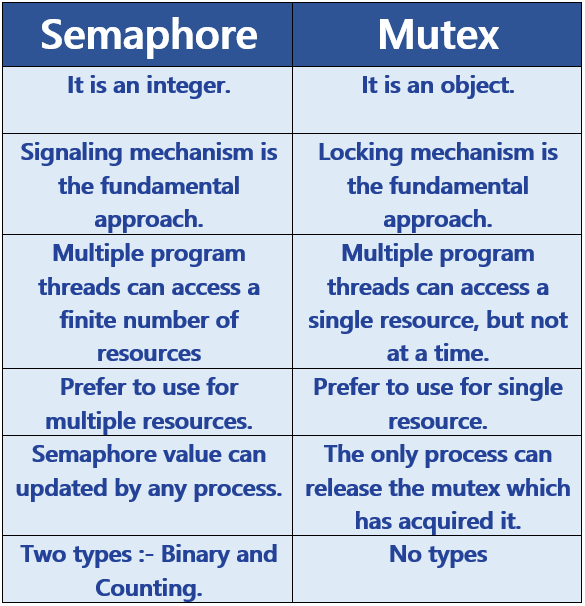
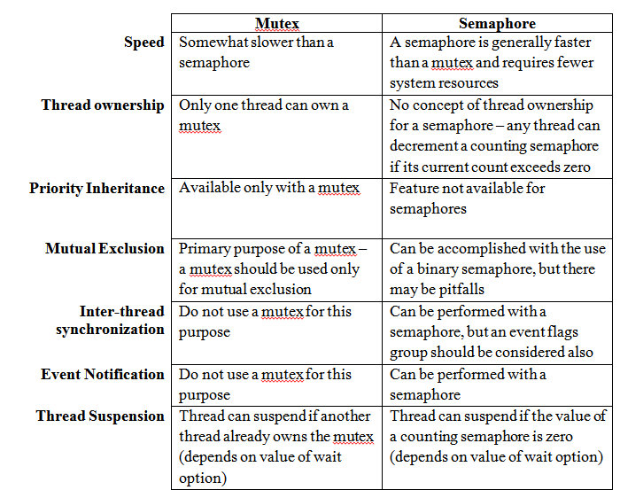

# Кратко про Системное программирование

### Инструменты сверху вниз
1. async await
2. Task
3. ThreadPool
4. Thread

### Термины: 
* Параллельное программирование
* Асинхронное программирование
* Многопоточное программирование
* Многозадачное программирование
* Реактивное программирование

Все что я описал сверху - это 
паралелльное программирование.

## Асинхронное программирование
Ключевые слова async await 
под каопотом работают с помощью класса
Task. Task - это класс, который обещает выполнить
какую-то задачу

Пример асинхронного программирования:

Если один официант обслуживает 5 столиков, то асинхронный подход.

Алгоритм:
* Пока заказы на закончились
* * Взять заказ у одного столика
* * Отнести на кухню
* * Поставить столик в режим ожидания (await)
* * Взять заказ у другого столика

### P.S. CLR, сам решает нужно ли выделять поток для выполнения задачи или нет
### Асинхронный код, может быть как однопоточным, так и многопоточным.

## Многопоточное программирование
не путать с многозадачным программированием

Если 5 официантов обслуживают 10 столиков, то многопоточный подход.
Если 5 официантотв обслуживают 1 столик, то это тоже многопоточный подход.

Первый пример - это многозадачное программирование.
Второй пример - это однозадачное программирование.


### Реактивное программирование - исходит от слова `reaction` 
Реактивное программирование - это когда мы реагируем на события.

Например когда мы нажимаем на кнопку, то мы реагируем на событие нажатия кнопки.

#### Почему такой подход тоже параллельный ?
Потому что мы можем реагировать на события параллельно.
Наример JavaScript и его callback'и.
С помощью event'ов мы можем реагировать на события параллельно.


Механизмы синхронизации:
* Monitor - самый базовый синхронизации
* Lock - это обертка над Monitor'ом. Тупо синтаксический сахар.
* Mutex - это синхронизация на уровне ОС. Она работает между процессами.
* Semaphore - это синхронизация на уровне ОС. Она работает внутри процесса.
* SemaphoreSlim - это синхронизация на уровне ОС. Она работает внутри процесса. Она быстрее чем Semaphore.




# PLINQ - Parallel LINQ
Смысл PLINQ - это LINQ, который работает параллельно.

Принцип работы - это обычные LINQ методы, которые работают параллельно.

Метод AsParallel() - это метод, который говорит, что мы хотим работать параллельно.  
Пример:


```csharp

#region WithoutPLINQ

using System.Diagnostics;

// List<int> nums = new();
//
// Stopwatch stopwatch = Stopwatch.StartNew();
//
// for (int i = 0; i < 1000000; i++)
// {
//     nums.Add(i);    
// }
//
// var res = nums.Where(x => x % 2 == 0);
//
// stopwatch.Stop();
//
// Console.WriteLine($"Elapsed time with PLINQ: {stopwatch.ElapsedMilliseconds} ms");
//

#endregion

#region WithPLINQ
/*
// Stopwatch stopwatch = Stopwatch.StartNew();
//
// var res = Enumerable.Range(0, 1000000).AsParallel().Where(x => x % 2 == 0);
//
// // parallel foreach
// Parallel.ForEach(res, (x) => ++x);
//
// stopwatch.Stop();
//
// Console.WriteLine($"Elapsed time with PLINQ: {stopwatch.ElapsedMilliseconds} ms");
*/
#endregion

```


