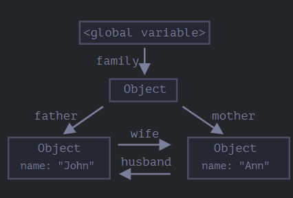
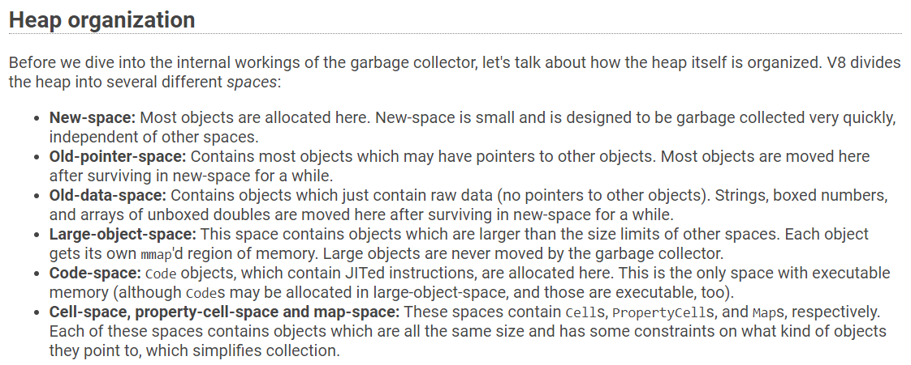

# Memory managment and Debug issues in JS 

Начннем с того, что управление памятью в JS происходит автоматически.
Это происходит еще более автоматически чем в C# ))

В JS есть механизм сборки мусора, который следит за тем, чтобы не было утечек памяти.

## Про сборку мусора в JS

Сборка мусора - это процесс, который следит за тем, чтобы не было утечек памяти.
Сборка мусора происходит автоматически.

[Про сборку мусора](https://javascript.info/garbage-collection)

```javascript
function marry(man, woman) {
  woman.husband = man;
  man.wife = woman;

  return {
    father: man,
    mother: woman
  }
}

let family = marry({
  name: "John"
}, {
  name: "Ann"
});
```





