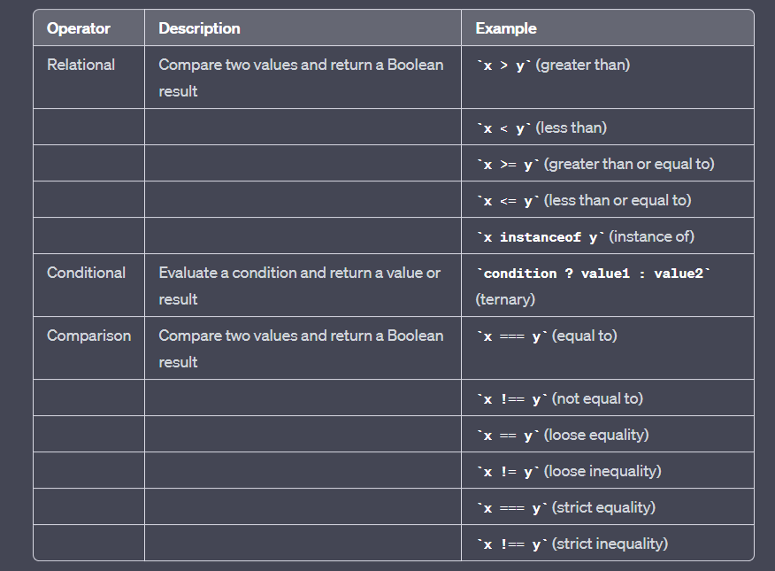

# Операторы
- Assignment Operators
- Comparison Operators
- Arithmetic Operators
- Bitwise Operators
- Logical Operators
- BigInt Operators
- String Operators
- Conditional Operators
- Comma Operators
- Unary Operators
- Relational Operator

## Assignment Operators - вы знаете 🐪
## Comparison Operators - вы знаете 🐪
## Arithmetic Operators - вы знаете 🐪
## Bitwise Operators - вы знаете 🐪, но я поясню
## Logical Operators - вы знаете 🐪
#### Logical vs Comparison 
- Comparison Operators and, or, not
- Logical Operators возращают bool
## BigInt Operators
- BigInt Operators возращают BigInt
- BigInt Operators не работают с обычными числами
Например:
```js
// n - это BigInt
let a = 1n;
let b = 2n;
console.log(a + b); // 3n
console.log(a + 2); // error
```
All bigInt operators are supported, except for unary plus and minus:
```js
let a = 1n;
console.log(-a); // Error: Cannot apply unary - to type bigint
```

## String Operators 
```javascript

let s = "my" + "string";
console.log(s); // mystring

console.log( '1' + 2 ); // "12"
console.log( 2 + '1' ); // "21"

console.log(2 + 2 + '1' ); // "41" and not "221"

console.log( 6 - '2' ); // 4, converts '2' to a number

console.log( '6' / '2' ); // 3, converts both operands to numbers

console.log('3' * 3) // 9 converts '3' to a number
```

## Conditional Operators - тернарный оператор

## Unary Operators - вы знаете 🐪
## Comma Operators 
```javascript
let a = (1 + 2, 3 + 4);
console.log(a); // 7 (the result of 3 + 4)
```
Comma operator - делает все действия и возвращает последнее значение

## Relational Operator




